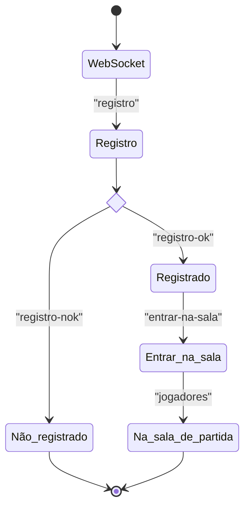

# SMU 2023.1

Projeto aos moldes do [semestre 2011.1](https://github.com/boidacarapreta/smu20211/milestones?direction=asc&sort=due_date&state=closed).

## Máquinas de estado

Registro e entrada na sala de partida:

## Repositórios dos alunos

| Aluno                                                 | Entrega 1 | Entrega 2 | Entrega 3 | Entrega 4 | Entrega 5 | Entrega 6 | Entrega 7 | Entrega 8 |
| ----------------------------------------------------- | --------- | --------- | --------- | --------- | --------- | --------- | --------- | --------- |
| [Alana](https://github.com/alanamandim/smu20231)      | 6         | 6         | 6         | 6         |           |           |           |           |
| [Filipi](https://github.com/VirgilioFilipi/SMU2023.1) | 6         | 6         | 6         | 0         |           |           |           |           |
