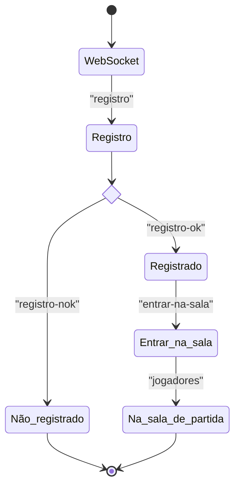

# Máquina de estado

Registro e entrada na sala de partida:

```mermaid
stateDiagram-v2
    state if_registro <<choice>>

    [*] --> WebSocket

    WebSocket --> Registro: "registro"

    Registro --> if_registro
    if_registro --> Registrado: "registro-ok"
    if_registro --> Não_registrado: "registro-nok"

    Não_registrado --> [*]

    Registrado --> Entrar_na_sala: "entrar-na-sala"
    Entrar_na_sala --> Na_sala_de_partida: "jogadores"
    Na_sala_de_partida --> [*]
```
